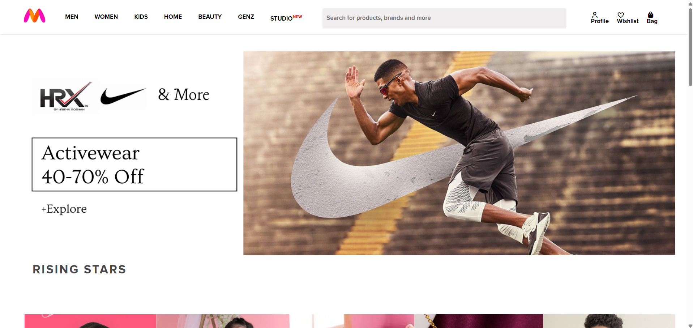

# Myntra Clone

## Overview

A frontend clone of the Myntra website built using HTML and CSS. The project recreates the visual layout and user interface of Myntra's homepage, focusing on responsive design, styling, and page structure.

## Features

- Responsive design
- Navigation bar
- Promotional banners
- Product showcase sections
- Footer section
- Custom typography and styling
- Clean user interface inspired by Myntra

## Tech Stack

- HTML5
- CSS3

## Learning Outcomes

- Website layout structuring
- Responsive web design
- CSS styling and positioning
- Flexbox implementation
- Real-world UI replication

## Project Type

Frontend Web Development Project

##Live demo link- 

## Screenshots
### Landing Page

### Image Gallery

## Author

Jhanvi Gupta
